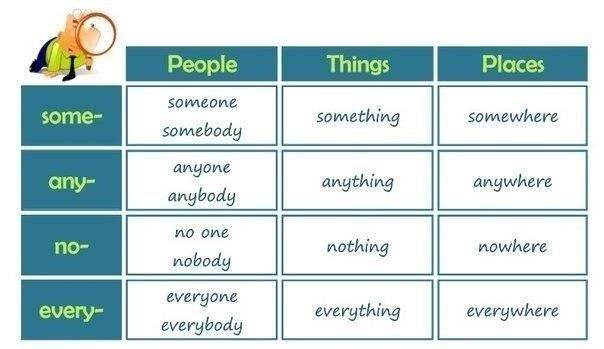

# Expresiones de Tiempo y Cantidad

## Nouns and pronouns

### Indefinite Pronouns: Prefix and Suffix

There are 4 indefinite pronouns:

- some
- any
- no
- every

### Indefinite Pronouns: `else` use

Se usa `else` para referirse a otra gente, otros lugares u otras cosas:

 + No one else came to work today, only the engineers  ==>  No hubo nadie más que llegó a trabajar hoy, solo los ingenieros
 + If he can't help us, we'll ask somebody else  ==>  Si no puede ayudarnos, le preguntaremos a alguien más
 + I think this si someone else's laptop  ==>  Creo que este es el portátil de alguien más  ==>  Como es el ordenador de alguien más, por eso se añade `'s` para indicar la pertenencia

### Indefinite Pronouns: Variable Indefinite Pronouns

There are 4 variable indefinite pronouns:

- `All`: Se refiere al 100% de algo  ==>  `All` of the students here are from the UK
- `Most`: Se refiere a la mayoría de algo (0%-70%)  ==>  `Most` of the students here are from the UK
- `Some`: Se refiere a una parte baja de algo (40%-100%)  ==>  `Some` of the students here are from the UK
- `None`: Se refiere a que no hay nada de algo  ==>  `None` of the students here are from the UK

### Contable nouns and uncountable nouns
