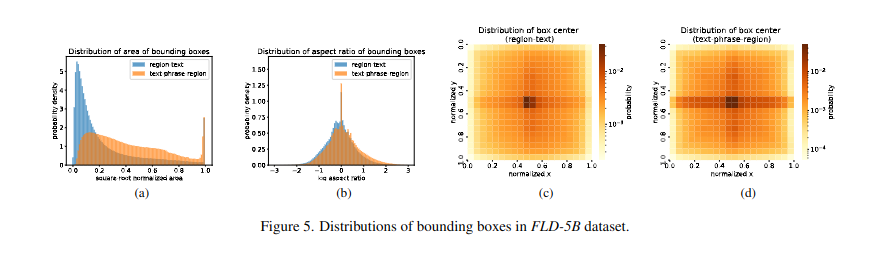

# Florence-2: Advancing a Unified Representation for a Variety of Vision Tasks

## Abstract

Presentamos Florence-2, un nuevo modelo de base de visión con una representación unificada, basada en prompts, para una variedad de tareas de visión por computadora y visión-lenguaje. Mientras que los modelos de visión grandes existentes sobresalen en el aprendizaje por transferencia, tienen dificultades para realizar una diversidad de tareas con instrucciones simples, una capacidad que implica manejar la complejidad de varias jerarquías espaciales y granularidad semántica. Florence-2 fue diseñado para tomar prompts de texto como instrucciones de tareas y generar resultados deseables en forma de texto, ya sea subtitulado, detección de objetos, grounding o segmentación. Esta configuración de aprendizaje multitarea requiere datos anotados a gran escala y de alta calidad. Para este fin, co-desarrollamos FLD-5B, que consta de 5,4 mil millones de anotaciones visuales completas en 126 millones de imágenes, utilizando una estrategia iterativa de anotación de imágenes automatizada y refinamiento del modelo. Adoptamos una estructura de secuencia a secuencia para entrenar a Florence-2 para realizar tareas de visión versátiles y completas. Las evaluaciones exhaustivas en numerosas tareas demostraron que Florence-2 es un fuerte contendiente de modelo de base de visión con capacidades sin precedentes de cero disparos y ajuste fino.

## 1. Introducción

En el ámbito de los sistemas de Inteligencia Artificial General (AGI), ha habido un cambio notable hacia la utilización de representaciones pre-entrenadas y versátiles, reconocidas por sus beneficios agnósticos a las tareas en diversas aplicaciones. Esta tendencia es evidente en el procesamiento del lenguaje natural (PNL), donde los modelos avanzados [5, 6, 19, 43, 65, 66] muestran adaptabilidad con un conocimiento completo que abarca varios dominios y tareas con instrucciones simples. El éxito del PNL motiva un enfoque paralelo en la visión por computadora.

La representación universal para diversas tareas relacionadas con la visión presenta desafíos únicos, en particular la necesidad de capacidades de percepción integrales. A diferencia del PNL, que se ocupa principalmente del texto, la visión por computadora requiere el manejo de datos visuales intrincados como la ubicación de objetos, los contornos enmascarados y los atributos. Lograr una representación universal en la visión por computadora exige una gestión hábil de un espectro de tareas complejas, organizadas bidimensionalmente como se ilustra en la Figura 1:

FIgure 1: Nuestro objetivo es construir un modelo básico de visión que permita amplias capacidades de percepción, incluidas la jerarquía espacial y la granularidad semántica. Para lograrlo, se preentrena un único modelo unificado Florence-2 en nuestro conjunto de datos FLD-5B, que abarca un total de 5.400 millones de anotaciones exhaustivas en 126 millones de imágenes, recopiladas por nuestro motor de datos Florence.

 * **Jerarquía espacial**: El modelo debe discernir los detalles espaciales a través de diferentes escalas, comprendiendo los conceptos a nivel de imagen y los detalles específicos de píxeles de grano fino. Acomodar la intrincada jerarquía espacial dentro de la visión exige que el modelo sea competente en el manejo de diversos niveles de granularidad.
 * **Granularidad semántica**: La representación universal en la visión por computadora debe abarcar un espectro de granularidad semántica. El modelo transiciona de subtítulos de alto nivel a descripciones matizadas, lo que permite una comprensión versátil para diversas aplicaciones.

Esta búsqueda se caracteriza por su distintivo y sustanciales desafíos. Un obstáculo clave es la escasez de anotaciones visuales integrales, lo que dificulta el desarrollo de un modelo fundamental capaz de capturar los intrincados matices de la jerarquía espacial y la granularidad semántica. Los conjuntos de datos existentes, como ImageNet [18], COCO [48] y Flickr30k Entities [61], adaptados para aplicaciones especializadas, están etiquetados extensamente por humanos. Para superar esta restricción, es imperativo generar anotaciones extensas para cada imagen a mayor escala.

Otro desafío es la ausencia de un marco de pre-entrenamiento unificado con una arquitectura de red singular que integre a la perfección la jerarquía espacial y la granularidad semántica en la visión por computadora. Los modelos tradicionales sobresalen en tareas como la detección de objetos [26, 97], la segmentación semántica [16, 82] y el subtitulado de imágenes [45, 78] con un diseño específico para cada tarea. Sin embargo, es esencial desarrollar un modelo integral y unificado que sea capaz de adaptarse a través de varias tareas de visión de una manera agnóstica a las tareas, incluso acomodando nuevas tareas con una mínima o ninguna sintonización fina específica de la tarea.

El modelo Florence [95] es pionero en la integración de los aspectos espaciales, temporales y multimodales en la visión por computadora a través del pre-entrenamiento unificado y la arquitectura de red. La primera versión evolutiva [95] sobresale en el aprendizaje por transferencia a través del pre-entrenamiento con pares de texto-imagen ruidosos y el ajuste fino específico de la tarea utilizando adaptadores especializados. Sin embargo, se basa en grandes conjuntos de datos específicos de la tarea y adaptadores, dejando brechas en la solución de los dos desafíos clave mencionados anteriormente.

En este documento, presentamos Florence-2, una columna vertebral universal lograda a través del aprendizaje multitarea con extensas anotaciones visuales. Esto da como resultado una representación unificada, basada en prompts, para diversas tareas de visión, abordando eficazmente los desafíos de los datos integrales limitados y la ausencia de una arquitectura unificada.

El aprendizaje multitarea requiere datos anotados a gran escala y de alta calidad. Nuestro motor de datos, en lugar de depender de la anotación manual que requiere mucha mano de obra, genera de forma autónoma un conjunto de datos visuales completo llamado FLD-5B, que abarca un total de 5,4 mil millones de anotaciones para 126 millones de imágenes. Este motor consta de dos módulos de procesamiento eficientes. El primer módulo utiliza modelos especializados para anotar imágenes de forma colaborativa y autónoma, alejándose del enfoque tradicional de anotación única y manual. Múltiples modelos trabajan juntos para llegar a un consenso, que recuerda al concepto de la sabiduría de las multitudes [33, 80, 89], asegurando una comprensión de la imagen más confiable e imparcial. El segundo módulo refina y filtra iterativamente estas anotaciones automatizadas utilizando modelos fundamentales bien entrenados.

Al utilizar este extenso conjunto de datos, nuestro modelo emplea una arquitectura de secuencia a secuencia (seq2seq) [17, 19, 66, 76], que integra un codificador de imagen y un codificador-decodificador multimodal. Este diseño acomoda un espectro de tareas de visión sin la necesidad de modificaciones arquitectónicas específicas de la tarea, alineándose con el espíritu de la comunidad del PNL para el desarrollo de modelos versátiles con una estructura subyacente consistente. Todas las anotaciones en el conjunto de datos FLD-5B se estandarizan uniformemente en salidas textuales, lo que facilita un enfoque unificado de aprendizaje multitarea con una optimización consistente con la misma función de pérdida como objetivo. El resultado es un modelo de base de visión versátil, Florence-2, capaz de realizar una variedad de tareas, como la detección de objetos, el subtitulado y el grounding, todo dentro de un único modelo gobernado por un conjunto uniforme de parámetros. La activación de la tarea se logra a través de prompts de texto, lo que refleja el enfoque utilizado por los Modelos de Lenguaje Grande (LLM) [65].

Nuestro enfoque logra una representación universal, demostrando una amplia aplicabilidad en varias tareas visuales. Los resultados clave incluyen:

 * Como un modelo de base de visión versátil, Florence-2 logra un nuevo rendimiento de última generación de cero disparos en tareas como el subtitulado en COCO [48], grounding visual en Flick30k [61] y comprensión de expresiones de referencia en RefCOCO/+/g [31, 56, 93].
 * Después del ajuste fino con datos anotados por humanos públicos, Florence-2, a pesar de su tamaño compacto, compite con modelos especializados más grandes. Notablemente, Florence-2 ajustado fino establece nuevos resultados de última generación en los puntos de referencia en RefCOCO/+/g.
 * La columna vertebral pre-entrenada de Florence-2 mejora el rendimiento en tareas posteriores, por ejemplo, la detección de objetos COCO y la segmentación de instancias, y la segmentación semántica ADE20K, superando tanto a los modelos supervisados como a los auto-supervisados. En comparación con los modelos pre-entrenados en ImageNet, el nuestro mejora la eficiencia del entrenamiento en 4 veces y logra mejoras sustanciales de 6,9, 5,5 y 5,9 puntos en los conjuntos de datos COCO [48] y ADE20K [98], utilizando los marcos Mask-RCNN [26], DINO [97] y UperNet [82] respectivamente.

## 2. Repensando el pre-entrenamiento del modelo de visión

En la búsqueda de un modelo de base de visión versátil, revisamos tres paradigmas predominantes de pre-entrenamiento: supervisado (por ejemplo, clasificación de ImageNet [18]), auto-supervisado (por ejemplo, SimCLR [9], MoCo [25], BEiT [4], MAE [24]) y débilmente supervisado (por ejemplo, CLIP [64], Florence [95], SAM [32]). Cada paradigma captura aspectos únicos de los datos visuales, pero está intrínsecamente limitado por las restricciones de los marcos de aprendizaje de una sola tarea. El pre-entrenamiento supervisado sobresale en el reconocimiento de objetos pero carece de adaptabilidad [38]; los algoritmos auto-supervisados revelan características intrincadas pero pueden enfatizar demasiado ciertos atributos [8]; los métodos débilmente supervisados aprovechan las anotaciones textuales no estructuradas pero solo producen una comprensión a nivel de imagen [64]. Para construir un modelo de base de visión unificado adecuado para diversas aplicaciones, debemos explorar estrategias de pre-entrenamiento innovadoras que superen las limitaciones de una sola tarea e integren la semántica textual y visual.

FIgure 2: Florence-2 consta de un codificador de imágenes y un codificador-decodificador multimodal estándar. Entrenamos a Florence-2 con nuestros datos FLD-5B en un paradigma de aprendizaje multitarea unificado, lo que dio como resultado un modelo de base de visión generaslist, que puede realizar varias tareas de visión

La comprensión de la imagen requiere capturar múltiples niveles de granularidad, desde la semántica global hasta los detalles locales, y comprender las relaciones espaciales entre objetos y entidades en su contexto semántico. Para abordar estos aspectos centrales de la comprensión de la imagen, nuestro enfoque incorpora un conjunto diverso de anotaciones, capturando eficazmente los matices de la comprensión visual y cerrando la brecha entre la comprensión de la visión y la del lenguaje.

### 2.1. Aprendizaje multitarea integral

Para desarrollar un modelo de base de visión versátil, formulamos una gama de objetivos de aprendizaje multitarea, cada uno adaptado para abordar aspectos específicos de la comprensión visual. Estos objetivos se alinean con nuestros criterios predefinidos: jerarquía espacial y granularidad semántica, inspirados en investigaciones recientes sobre el aprendizaje multitarea [2, 12, 14, 15, 55, 79]. Nuestro enfoque de aprendizaje multitarea incorpora tres objetivos de aprendizaje distintos, cada uno de los cuales aborda un nivel diferente de granularidad y comprensión semántica:

 * **Las tareas de comprensión a nivel de imagen** capturan la semántica de alto nivel y fomentan una comprensión integral de las imágenes a través de descripciones lingüísticas [13, 18, 34, 91]. Permiten que el modelo comprenda el contexto general de una imagen y capte las relaciones semánticas y los matices contextuales en el dominio del lenguaje. Las tareas ejemplares incluyen la clasificación de imágenes, el subtitulado y la respuesta a preguntas visuales.
 * **Las tareas de reconocimiento a nivel de región/píxel** facilitan la localización detallada de objetos y entidades dentro de las imágenes, capturando las relaciones entre los objetos y su contexto espacial. Las tareas incluyen la detección de objetos, la segmentación y la comprensión de expresiones de referencia.
 * **Las tareas de alineación visual-semántica de grano fino** requieren una comprensión de grano fino tanto del texto como de la imagen. Implica localizar las regiones de la imagen que corresponden a las frases de texto, como objetos, atributos o relaciones. Estas tareas desafían la capacidad de capturar los detalles locales de las entidades visuales y sus contextos semánticos, así como las interacciones entre los elementos textuales y visuales.

Al combinar estos tres objetivos de aprendizaje en un marco de aprendizaje multitarea, nuestro modelo fundamental aprende a manejar diferentes niveles de detalle y comprensión semántica. Esta alineación estratégica permite que nuestro modelo se ocupe de varios detalles espaciales, distinga los niveles de detalle en la comprensión y vaya más allá del reconocimiento superficial, aprendiendo finalmente una representación universal para la comprensión de la visión.

## 3. Modelo

Presentamos el modelo fundamental Florence-2, diseñado para el aprendizaje de representaciones universales, capaz de manejar diversas tareas de visión con un solo conjunto de pesos y una arquitectura unificada. Como se muestra en la Figura 2, Florence-2 emplea un paradigma de aprendizaje de secuencia a secuencia [77], integrando todas las tareas, descritas en la Sección 2, bajo un objetivo común de modelado del lenguaje. El modelo toma imágenes acopladas con prompts de tarea como instrucciones de tarea, y genera los resultados deseables en forma de texto. Utiliza un codificador de visión para convertir imágenes en incrustaciones de tokens visuales, que luego se concatenan con incrustaciones de texto y se procesan mediante un codificador-decodificador multimodal basado en transformadores para generar la respuesta. En las siguientes secciones, proporcionaremos una explicación detallada de cada componente del modelo.

**Formulación de la tarea**. Adoptamos un marco de secuencia a secuencia [10, 15, 55, 77] para abordar diversas tareas de visión de una manera unificada. Como se muestra en la Tabla 13, formulamos cada tarea como un problema de traducción: dada una imagen de entrada y un prompt específico de la tarea, generamos la respuesta de salida correspondiente. Dependiendo de la tarea, el prompt y la respuesta pueden ser texto o región:

 * **Texto**: Cuando el prompt o la respuesta es texto sin formato especial, lo mantenemos en nuestro formato final de secuencia a secuencia.
 * **Región**: Para tareas específicas de región, agregamos tokens de ubicación a la lista de vocabulario del tokenizador, que representan coordenadas cuantificadas. Creamos 1000 bins, similar a [10, 11, 55, 79], y representamos regiones utilizando formatos adaptados a los requisitos de la tarea:
   * **Representación de caja (x0, y0, x1, y1)**: Utilizado en tareas como la detección de objetos y el subtitulado denso de regiones, con tokens de ubicación correspondientes a las coordenadas de la caja. Los tokens de ubicación son las coordenadas de las esquinas superior izquierda e inferior derecha de la caja.
   * **Representación de caja cuádruple (x0, y0, ..., x3, y3)**: Para tareas de detección y reconocimiento de texto, utilizando tokens de ubicación para cada coordenada del cuadrilátero que encierra el texto. Los tokens de ubicación son las coordenadas de cada esquina de la caja cuádruple, comenzando desde la esquina superior izquierda y yendo en el sentido de las agujas del reloj.
   * **Representación de polígono (x0, y0, ..., xn, yn)**: Para tareas de segmentación de referencia, con tokens de ubicación que representan los vértices del polígono. Los tokens de ubicación son las coordenadas de los vértices del polígono, en el sentido de las agujas del reloj.

Al extender el vocabulario del tokenizador para incluir tokens de ubicación, permitimos que el modelo procese información específica de la región en un formato de aprendizaje unificado. Esto elimina la necesidad de diseñar cabezales específicos de la tarea para diferentes tareas y permite un enfoque más centrado en los datos.

**Codificador de visión**. Empleamos DaViT [20] como el codificador de visión. Procesa una imagen de entrada I ∈ RH×W×3 (con H y W denotando altura y ancho, respectivamente) en incrustaciones de tokens visuales aplanados V ∈ RNv×Dv, donde Nv y Dv representan el número y la dimensionalidad de los tokens visuales, respectivamente.

**Codificador-decodificador multimodal**. Utilizamos una arquitectura de transformador de codificador-decodificador estándar para procesar incrustaciones de tokens visuales y de lenguaje. Primero obtenemos incrustaciones de texto de prompt Tprompt ∈ RNt×D utilizando nuestro tokenizador de lenguaje extendido y la capa de incrustación de palabras [43]. Luego, concatenamos las incrustaciones de tokens visuales con las incrustaciones de prompts para formar la entrada del módulo codificador multimodal, X = [V′, Tprompt], donde V′ ∈ RNv×D se obtiene aplicando una proyección lineal y una capa LayerNorm [3] a V para la alineación de la dimensionalidad.

**Objetivo de optimización**. Dada la entrada x combinada de la imagen y el prompt, y el objetivo y, usamos el modelado de lenguaje estándar con pérdida de entropía cruzada para todas las tareas.

L = − |y|∑ i=1

logPθ(yi|y<i, x), (1)

donde θ son los parámetros de la red, |y| es el número de tokens objetivo.

## 4. Motor de datos

Para entrenar nuestro modelo Florence-2, necesitamos un conjunto de datos multitarea integral, a gran escala y de alta calidad que abarque varios aspectos de los datos de imagen. Dada la escasez de tales datos, hemos desarrollado un nuevo conjunto de datos de imágenes multitarea. Este conjunto de datos FLD-5B incluye 126 millones de imágenes, 500 millones de anotaciones de texto y 1.3 mil millones de anotaciones de texto-región, y 3.6 mil millones de anotaciones de texto-frase-región en diferentes tareas. Explicamos extensamente nuestros procedimientos de recopilación y anotación de datos, que abarcan adaptaciones para varios tipos de anotaciones. El pipeline del motor de datos, que se muestra en la Figura 3, se discutirá en las siguientes secciones.

### 4.1. Recopilación de imágenes

Construimos nuestros datos reuniendo una colección diversa de imágenes de varias fuentes. Comenzamos con la identificación de tres tareas clave que actúan como fuentes primarias para nuestro corpus de imágenes: clasificación de imágenes, detección de objetos y subtitulado de imágenes. En consecuencia, seleccionamos y combinamos cinco conjuntos de datos distintos que se originan en las tareas antes mencionadas: ImageNet-22k [18], Object 365 [70], Open Images [40], Conceptual Captions [71] y LAION [68] filtrado por [45]. Esta combinación da como resultado un conjunto de datos de 126 millones de imágenes en total.

FIgure 3: El motor de datos Florence-2 consta de tres fases esenciales: (1) anotación inicial empleando modelos especializados, (2) filtrado de datos para corregir errores y eliminar anotaciones irrelevantes, y (3) un proceso iterativo para el refinamiento de los datos. Nuestro conjunto de datos final (FLD-5B), de más de 5.000 millones de anotaciones, contiene 126 millones de imágenes, 500 millones de anotaciones de texto, 1.300 millones de anotaciones de texto-región y 3.600 millones de anotaciones de texto-frase-región.

### 4.2. Anotación de datos

Nuestro objetivo principal es generar anotaciones integrales que puedan respaldar el aprendizaje multitarea de manera efectiva. En consecuencia, nuestros esfuerzos de anotación abarcan una gama completa de tareas, encapsuladas en tres categorías de anotaciones discretas: texto, pares de texto-región y tripletas de texto-frase-región, que se ilustra en la Figura 4. El flujo de trabajo de anotación de datos consta de tres fases esenciales, cada una de las cuales garantiza la precisión y la calidad de las anotaciones: (1) anotación inicial empleando modelos especializados, (2) filtrado de datos para corregir errores y eliminar anotaciones irrelevantes, y (3) un proceso iterativo para el refinamiento de datos.

**Anotación inicial con modelos especializados**. Para iniciar el proceso de anotación para cada tipo de anotación, empleamos etiquetas sintéticas obtenidas de modelos especializados. Estos modelos especializados son una combinación de modelos fuera de línea entrenados en una variedad de conjuntos de datos disponibles públicamente y servicios en línea alojados en plataformas en la nube. Están específicamente diseñados para sobresalir en la anotación de sus respectivos tipos de anotación.

Vale la pena señalar que ciertos conjuntos de datos de imágenes ya pueden contener anotaciones parciales para algunos tipos de anotaciones. Por ejemplo, el conjunto de datos Object 365 [70] ya incluye cuadros delimitadores anotados por humanos y las categorías correspondientes como anotaciones de texto-región. En tales casos, fusionamos las anotaciones preexistentes con las etiquetas sintéticas generadas por los modelos especializados. Este enfoque mejora la cobertura y la diversidad de las anotaciones.

Además, anotaciones específicas, como descripciones detalladas en el tipo de anotación de texto, están representadas por conjuntos de datos de un tamaño considerablemente pequeño. Esto inherentemente plantea desafíos para obtener modelos especializados de alto rendimiento. En consecuencia, optamos por omitir estas tareas durante la fase de anotación inicial. Las anotaciones para estas tareas se generan más tarde durante el proceso iterativo de refinamiento de datos.

En resumen, a través de los rigurosos procedimientos de anotación inicial, nos aseguramos de que el conjunto de datos agregado de 126 millones de imágenes esté completamente etiquetado en la mayoría de los tipos de anotaciones.

**Filtrado y mejora de datos**. Las anotaciones iniciales obtenidas de los modelos especializados, aunque completas, son susceptibles al ruido y la imprecisión. En respuesta a este desafío, hemos implementado un proceso de filtrado multifacético para refinar y eliminar anotaciones no deseadas. Nuestro protocolo de filtrado general se centra principalmente en dos tipos de datos en las anotaciones: datos de texto y de región.

Primero, en lo que respecta a las anotaciones textuales, nos inspiramos en DiHT [63] y desarrollamos una herramienta de análisis basada en SpaCy [28] para extraer objetos, atributos y acciones. Filtramos textos que contienen objetos excesivos, ya que tienden a introducir ruido y pueden no reflejar con precisión el contenido real en las imágenes correspondientes. Además, evaluamos la complejidad de las acciones y los objetos midiendo su grado de nodo en el árbol de análisis de dependencias. Conservamos textos con una cierta complejidad mínima de acción y objeto para garantizar la riqueza de los conceptos visuales en las imágenes.

En segundo lugar, en relación con las anotaciones de región, específicamente los cuadros delimitadores, eliminamos los cuadros ruidosos por debajo de un umbral de puntuación de confianza. Como complemento a esto, también empleamos la supresión no máxima para reducir los cuadros delimitadores redundantes o superpuestos.

**Refinamiento iterativo de datos**. Utilizando nuestras anotaciones iniciales filtradas, entrenamos un modelo multitarea que procesa secuencias de datos. Al evaluar este modelo con nuestras imágenes de entrenamiento, discernimos una mejora notable en sus predicciones, particularmente en instancias donde las etiquetas originales estaban empañadas por inexactitudes o ruido extraño, como en los textos alternativos. Motivados por estos hallazgos, integramos estas anotaciones actualizadas con nuestras originales y sometimos el modelo a otra iteración de entrenamiento. Este proceso de refinamiento cíclico mejora incrementalmente la calidad de nuestro conjunto de datos de entrenamiento.

En el caso de las tareas que inicialmente omitimos debido a la insuficiencia de datos para el entrenamiento de un modelo especializado robusto, aprovechamos el modelo entrenado iterativamente para fines de pre-entrenamiento. El ajuste fino posterior de este modelo pre-entrenado con el conjunto de datos disperso mostró un rendimiento superior en comparación con un modelo entrenado desde cero con los mismos datos. Por lo tanto, aprovechamos el modelo ajustado fino como especialista para anotar nuestro extenso conjunto de datos que comprende 126 millones de imágenes, asegurando una cobertura de anotaciones completa.

### 4.3. Variaciones específicas de la anotación

En la Sección 4.2, presentamos nuestro flujo de trabajo general de anotación. Esta sección profundiza en cada tipo de anotación y las variaciones correspondientes del procedimiento de anotación.

**Texto**. Las anotaciones de texto categorizan las imágenes utilizando tres tipos de granularidades: breve, detallada y más detallada. El texto breve incluye solo una oración que demuestra los objetos y actividades más destacados, que es similar al subtítulo de COCO [13]. Por el contrario, el texto detallado y el texto más detallado contienen varias oraciones que describen la imagen con objetos, atributos y acciones más ricos.

Para el texto breve, se entrena un modelo Florence-2 como especialista en conjuntos de datos de subtítulos de imágenes y texto-imagen disponibles públicamente, creando un modelo de imagen a texto para anotaciones iniciales. El refinamiento iterativo se utiliza para minimizar el ruido en estos textos. Para el texto detallado, los prompts que incluyen anotaciones de imagen existentes, como el texto breve y las anotaciones de texto-región, se alimentan a modelos de lenguaje grande (LLM) o modelos multimodales grandes (LMM) para generar descripciones completas. Debido al alto costo de los modelos grandes, solo se genera un pequeño conjunto de texto detallado y texto más detallado. Estos se utilizan para ajustar fino al especialista en subtítulos, desarrollando un especialista en descripción detallada para anotaciones adicionales.

**Pares de texto-región**. Los pares de texto-región proporcionan anotaciones textuales descriptivas para regiones semánticas en la imagen. Las regiones semánticas incluyen regiones de objetos visuales, así como regiones de texto. La región está representada por un cuadro delimitador ajustado que rodea la región. Además, cada región se puede anotar con diversos grados de granularidad, incluidas frases y oraciones, que contribuyen a una comprensión más rica de la región.

Los pares de texto-región se anotan de manera diferente para las regiones de texto y las regiones de objetos visuales. Las regiones de texto se etiquetan utilizando la API de OCR de Azure AI Services [1], mientras que los objetos visuales se anotan inicialmente con un detector de objetos DINO [97] entrenado en conjuntos de datos públicos. El filtrado de datos, que incluye el umbral de confianza y la supresión no máxima, elimina los cuadros ruidosos. Las anotaciones textuales para las regiones de objetos visuales se enriquecen aún más mediante texto breve generado a partir de un modelo de imagen a texto con regiones de imagen recortadas. Cada región recibe entonces tres anotaciones textuales: frase de la categoría del objeto, texto breve y fragmentos de frase nominal del texto breve. El modelo Florence-1 [95] determina la anotación textual más similar a cada región de la imagen.

**Tripletas de texto-frase-región**. Las tripletas de texto-frase-región constan de un texto descriptivo de la imagen, frases nominales en este texto relacionadas con los objetos de la imagen y anotaciones de región para estos objetos. El texto incluye texto breve, detallado y más detallado generado anteriormente. Para cada texto, el modelo Grounding DINO [50] identifica frases nominales y crea cuadros delimitadores para ellas. Además, el modelo SAM [32] genera máscaras de segmentación para cada cuadro, ofreciendo una localización de objetos más precisa. Durante el filtrado de datos, se aplica un umbral de puntuación de confianza tanto a las frases nominales como a los cuadros delimitadores para garantizar la relevancia. También se utiliza una lista negra para excluir frases nominales irrelevantes como pronombres y conceptos abstractos.

## 5. Conjunto de datos

Esta sección presenta las estadísticas y el análisis de FLD-5B que construimos utilizando el motor de datos en la Sección 4. Comenzamos con una descripción general del conjunto de datos y lo comparamos con los trabajos recientes. Luego mostramos análisis adicionales de estadísticas de anotaciones detalladas, cobertura semántica y cobertura espacial en el conjunto de datos establecido.

### 5.1. Descripción general

Siguiendo el motor de datos, construimos un conjunto de entrenamiento a gran escala (FLD-5B) de 126 millones de imágenes, más de 500 millones de anotaciones de texto, 1.3 mil millones de anotaciones de texto-región y 3.6 mil millones de anotaciones de texto-frase-región. Cada imagen está anotada con texto, pares de texto-región y tripletas de texto-frase-región, y cada tipo de anotación tiene varias instancias que varían en diversa granularidad. Un ejemplo ilustrativo de una imagen y sus anotaciones correspondientes se puede encontrar en la Figura 4.

Proporcionamos una comparación entre nuestro conjunto de datos y los conjuntos de datos existentes que se utilizan comúnmente para entrenar modelos fundamentales en la Tabla 1. Nuestro conjunto de datos tiene varias ventajas sobre los anteriores, como tener más anotaciones en total y por imagen. Además, las anotaciones en nuestro conjunto de datos abarcan múltiples niveles de granularidad espacial y semántica, lo que permite tareas de comprensión visual más diversas y completas.

### 5.2. Análisis de datos

**Estadísticas de anotaciones**. Las estadísticas para cada tipo de anotación dentro de nuestro conjunto de datos se presentan en la Tabla 2.

En primer lugar, tenemos alrededor de 500 millones de anotaciones de texto, incluidos textos breves, detallados y más detallados con diferentes longitudes. Cabe destacar que nuestro texto detallado y más detallado tiene 4 veces y 9 veces el número de tokens en comparación con el texto breve que es similar a los subtítulos de COCO [13]. Estas anotaciones extensas proporcionan información mucho más rica para una comprensión visual completa.

Figure 4: Ejemplo ilustrativo de una imagen y sus correspondientes anotaciones en el conjunto de datos FLD-5B. Cada imagen de FLD-5B está anotada con texto, pares de texto-región y tripletas de texto-frase-región por el motor de datos Florence, que abarca múltiples jerarquías espaciales, una granularidad progresiva de breve a detallada y un amplio espectro semántico, lo que permite una comprensión visual más completa desde diversas perspectivas.

|Dataset |Rep. Model| #Images| #Annotations| Spatial hierarchy| Semantics granularity|
|--------|----------|--------|-------------|------------------|----------------------|
|JFT300M [21]| ViT| 300M| 300M| Image-level| Coarse|
|WIT [64]| CLIP| 400M| 400M| Image-level| Coarse|
|SA-1B [32]| SAM| 11M |1B| Region-level| Non-semantic|
|GrIT [60]| Kosmos-2| 91M| 137M| Image & Region-level| Fine-grained|
|M3W [2]| Flamingo| 185M| 43.3M*| Multi-image-level| Fine-grained|
|FLD-5B (ours)| Florence-2 (ours)| 126M| 5B| Image & Region-level| Coarse to fine-grained|

Tabla 1: Comparación con conjuntos de datos en el entrenamiento de modelos de fundamentos de visión. *Las anotaciones de Flamingo se contabilizan en el número de documentos, donde cada documento puede tener varias imágenes.

Además, nuestro conjunto de datos tiene alrededor de 1.3 mil millones de anotaciones de texto-región, que es más de 30 veces más grande que los conjuntos de datos académicos de detección de objetos como OpenImages [40] y Object 365 [70]. En promedio, cada imagen tiene alrededor de 5 regiones, y cada región está anotada con una frase o un texto breve relativamente más largo. Tenga en cuenta que la anotación de texto breve regional (2.55 tokens promedio) es más corta que la anotación de texto breve típica (7.95 tokens promedio), ya que la anotación de texto breve regional en realidad incluye una mezcla de frase, fragmentos nominales y texto breve según la puntuación de Florence-1. Se pueden encontrar más detalles en la Sección 4.3 - pares de texto-región.

Además, recopilamos anotaciones de texto-frase-región que incluyen más de 3.6 mil millones de pares de frase-región para las 500 millones de anotaciones de texto. Específicamente, la anotación de texto breve tiene 4.27 pares de frase-región promedio, mientras que la anotación de texto detallada y más detallada tiene más de 10 pares, lo que indica que la anotación de texto más rica cubre más objetos y sus frases correspondientes en el texto.

**Cobertura semántica**. Nuestras anotaciones de texto comprenden varios tipos de texto, que abordan diferentes niveles de detalle. Para evaluar la cobertura semántica, empleamos SpaCy [28] para la tokenización y el análisis, inspirado en DiHT [63]. Este proceso produce etiquetas de parte del discurso (POS) y el árbol de análisis de dependencias entre tokens. Establecemos reglas heurísticas basadas en etiquetas POS, categorizando tokens en tipos de elementos semánticos, por ejemplo, objetos, atributos, acciones y nombres propios. Además, introducimos el concepto de complejidad de tokens, medida por los grados totales del token en el árbol de análisis de dependencias cuando se trata como un gráfico no dirigido. Esta complejidad refleja la riqueza de las conexiones semánticas. En nuestro estudio, nos enfocamos en medir la complejidad de los objetos y las acciones.

|Annotation Type| Text Type| #Image Annotations| #Avg Tokens| #Regions| #Avg Regions| #Avg Regional Tokens|
|---------------|----------|-------------------|------------|---------|--------------|---------------------|
|Text| Brief| 235M| 7.95| -| -| -|
| |Detailed| 126M| 31.65| -| -| -|
| |More detailed| 126M| 70.53| -| -| -|
|Region-Text| Phrase| 126M| -| 681M| 5.42| 1.19|
| |Brief| 126M| -| 681M| 5.42| 2.55|
|Text-Phrase-Region| Brief| 235M| 7.95| 1007M| 4.27| 1.93|
| |Detailed| 126M| 31.65| 1289M| 10.25| 1.49|
| |More detailed| 126M| 70.53| 1278M |10.17| 1.35|

Tabla 2: Estadísticas de anotación del conjunto de datos FLD-5B

La Tabla 3 presenta las estadísticas sobre el número promedio de elementos semánticos y su complejidad correspondiente. Los resultados indican que todas las mediciones aumentan con la inclusión de más detalles en las anotaciones de texto. Notablemente, las acciones promedio experimentan el impulso más significativo, con texto detallado y más detallado que exhibe aumentos de 7 veces y 15 veces, respectivamente, en comparación con el texto breve. Esto destaca las limitaciones de las anotaciones de texto breve tradicionales para describir las acciones de la imagen. Por el contrario, el incremento en los nombres propios es relativamente bajo, potencialmente porque los especialistas a menudo describen los objetos de manera más general que utilizando nombres propios específicos. En términos de mediciones de complejidad, tanto los objetos como las acciones muestran más conexiones semánticas en anotaciones de texto detalladas. La complejidad de las acciones exhibe una mayor mejora, alineándose con nuestra observación del creciente número de acciones.

**Cobertura espacial**. Nuestras anotaciones de texto-región y texto-frase-región, representadas por cuadros delimitadores y máscaras, capturan la ubicación de los conceptos visuales dentro de las imágenes. La distribución de las áreas de los cuadros, como se muestra en la Figura 5a, revela más cuadros pequeños en pares de texto-región y una distribución uniforme del tamaño de los cuadros en tripletas de texto-frase-región. Esta diferencia proviene de los orígenes divergentes de estos cuadros: detectores de objetos para pares de texto-región y un modelo de grounding para tripletas de texto-frase-región, que alinea los cuadros con frases textuales que representan conceptos de imagen tanto localizados como generales. En la Figura 5b, se ilustra la distribución en formato logarítmico de las relaciones de aspecto. Los pares de texto-región y las tripletas de texto-frase-región exhiben distribuciones simétricas similares, cubriendo una amplia gama de relaciones de aspecto. Los mapas de calor del centro de la caja para cada tipo de anotación, que se muestran en las Figuras 5c y 5d, indican un sesgo central, con pares de texto-región que muestran una distribución más uniforme que las tripletas de texto-frase-región.

|Text Type |Brief| Detailed |More detailed|
|----------|------|----------|-------------|
|#Image Annotations| 235M| 126M| 126M|
|#Avg Tokens| 7.95| 31.65| 70.53|
|#Avg Objects| 3.23| 13.31| 28.06|
|#Avg Attributes| 2.80| 7.27| 16.25|
|#Avg Actions| 0.58| 4.21| 8.76|
|#Proper Nouns| 1.10| 2.40| 2.41|
|Avg Object Complexity| 2.80| 4.00| 4.02|
|Avg Action Complexity| 1.14| 3.63| 4.38|

Tabla 3: Estadísticas del número medio de elementos semánticos y complejidad correspondiente en el conjunto de datos FLD-5B

## 6. Experimentos

Nuestros modelos Florence-2 se entrenan en FLD-5B para aprender una representación de imagen universal. Realizamos nuestros experimentos en tres partes principales: (1) Evaluamos el rendimiento de cero disparos de nuestro método en varias tareas para mostrar su capacidad inherente para manejar múltiples tareas sin ningún ajuste fino adicional en datos específicos de la tarea utilizando un solo modelo generalista. (2) Mostramos la adaptabilidad de nuestro método entrenando aún más un solo modelo generalista con datos supervisados adicionales en una amplia gama de tareas, logrando un rendimiento competitivo de última generación. (3) Examinamos el rendimiento de la representación visual aprendida en las tareas posteriores como la columna vertebral para mostrar la superioridad de nuestro método de pre-entrenamiento sobre los enfoques anteriores.

### 6.1. Configuración

Investigamos dos variantes de modelo con diferentes tamaños: el modelo Florence-2-B con 232 millones de parámetros y el modelo Florence-2-L con 771 millones de parámetros. Las arquitecturas detalladas de cada modelo se dan en la Tabla 15. Inicializamos los pesos del codificador de imagen y el codificador-decodificador multimodal de UniCL [87] y BART [43], respectivamente.

Adoptamos AdamW [54] con decaimiento de la tasa de aprendizaje del coseno [53] para entrenar nuestros modelos. Aprovechamos Deep-speed [67] y la precisión mixta para mejorar la eficiencia del entrenamiento. La tasa de aprendizaje máxima se establece en 1e − 4 para el modelo base y 1e− 5 para el modelo grande. Se aplica un calentamiento lineal a la tasa de aprendizaje máxima durante los primeros 5000 pasos de optimización.

Entrenamos nuestros modelos con un tamaño de mini-lote de 2048/3072 (base/grande) y un tamaño de imagen de 384×384 hasta alcanzar los 3 mil millones de muestras de entrenamiento efectivas. Similar a [15, 29, 64, 92, 95], realizamos un ajuste de alta resolución con un tamaño de imagen de 768×768 para 0.5 mil millones de muestras para el modelo base y 0.1 mil millones de muestras para el modelo grande.

### 6.2. Evaluación de cero disparos en todas las tareas

Presentamos un potente modelo de base de visión que no requiere anotaciones supervisadas específicas de la tarea para el ajuste fino. El rendimiento de cero disparos de nuestro modelo se muestra en la Tabla 4. Para tareas a nivel de imagen, Florence-2-L logra una puntuación CIDEr de 135.6 en el punto de referencia de subtítulos COCO [48], utilizando menos del 1% de los parámetros en comparación con el modelo Flamingo [2] de 80 mil millones (que tiene una puntuación CIDEr de 84.3). Para tareas de grounding y comprensión de expresiones de referencia a nivel de región, Florence-2-L establece un nuevo récord en el rendimiento de cero disparos logrando una mejora de 5.7 en Flickr30k [61] Recall@1, y aproximadamente 4%, 8% y 8% de mejoras absolutas en Refcoco, Refcoco+ y Refcocog [94], respectivamente, en comparación con el modelo Kosmos-2 [60], que tiene 1.6 mil millones de parámetros. Además, nuestro modelo pre-entrenado alcanza un 35.8% mIOU en la tarea de segmentación de expresiones de referencia (RES) Refcoco [94], una capacidad que no es compatible con los modelos fundamentales anteriores.

### 6.3. Modelo Generalista con Datos Supervisados Públicos

Demostramos la versatilidad y la eficacia de nuestro modelo como base de visión que se puede transferir a varias tareas posteriores. Ajustamos los modelos Florence-2 añadiendo una colección de conjuntos de datos públicos que cubren tareas a nivel de imagen, región y píxel, dando como resultado un modelo generalista para diversas tareas de visión. Los detalles de la recopilación del conjunto de datos se proporcionan en el Apéndice B. Las Tablas 5 y 6 comparan nuestro modelo con otros modelos de última generación. Nuestras principales conclusiones son:

**Diseño simple para un gran rendimiento**. Florence-2 demuestra un gran rendimiento con un codificador-decodificador Transformer multimodal estándar sin diseños especiales, en particular para tareas a nivel de región y píxel. Por ejemplo, Florence-2-L supera a PolyFormer [49] tanto en la tarea REC de RefCOCO como en la tarea RES por 3.0 de precisión@0.5 y 3.54 mIOU respectivamente, donde PolyFormer [49] adapta una cabeza de predicción basada en la regresión diseñada específicamente para las coordenadas. Florence-2-L también supera al método SOTA anterior UNINEXT [84] en RefCOCO por 0.8 de precisión@0.5, donde UNINEXT [84] se basa en el detector de objetos avanzado Deformable DETR [100] y DINO [97].

**Rendimiento competitivo con menos parámetros**. Florence-2-L logra un rendimiento competitivo sin necesidad de LLMs, mostrando eficiencia en el manejo de diversas tareas mientras mantiene un tamaño compacto. Por ejemplo, Florence-2-L alcanza una puntuación CIDEr de 140.0 en la división de prueba karpathy de COCO Caption [30], superando a los modelos con significativamente más parámetros, como Flamingo (80B parámetros, 138.1 puntuación CIDEr).

**Generalización adaptable a través de los niveles de tareas**. Florence-2 demuestra un rendimiento competitivo en tareas a nivel de imagen, píxel y región, lo que enfatiza su adaptabilidad y eficacia para abordar diversos desafíos en la visión por computadora y el procesamiento del lenguaje natural. Por ejemplo, en la tarea TextVQA, Florence-2-L establece un nuevo estado del arte con una precisión del 81.5 sin ninguna entrada externa de tokens OCR, superando los métodos SOTA anteriores [12, 15]. Estos logros enfatizan la eficiencia de Florence-2 en el manejo de diversas tareas mientras se mantiene un tamaño compacto, lo que la convierte en un activo único y valioso en el panorama en constante evolución de la investigación y las aplicaciones de la IA.

| Method        | #params | COCO Cap. | COCO Cap. | NoCaps | TextCaps | COCO Det. | Flickr30k | Refcoco | Refcoco+ | Refcocog | Refcoco RES |
|-------------- | -------- | :--------: | :--------: | :----: | :------: | :--------: | :-------: | :------: | :-------: | :-------: | :----------: |
|               |          |    test   |    val    |   val  |   val   | val2017 |   test   | test-A  |  test-B   |   val   | test-A  | test-B   |  val   |  test   |  val    |
|               |          |   CIDEr   |   CIDEr   | CIDEr |  CIDEr  |   mAP    |   R@1    | Accuracy | Accuracy | Accuracy |    mIoU     |
| Flamingo [2]  | 80B      |   84.3    |     -      |   -    |    -     |     -      |     -      |    -     |     -      |     -      |      -       |
| Kosmos-2 [60] | 1.6B     |     -      |     -      |   -    |    -     |     -      |  78.7     | 52.3     |  57.4     |  47.3     | 45.5    | 50.7     | 42.2    | 60.6    | 61.7     |    -       |
| Florence-2-B  | 0.23B    |  133.0    |  118.7     |  70.1  |  34.7    |  34.7     |  83.6     | 53.9     |  58.4     |  49.7     | 51.5    | 56.4     | 47.9    | 66.3    | 65.1     |   34.6      |
| Florence-2-L  | 0.77B    |  135.6    |  120.8     |  72.8  |  37.5    |  37.5     |  84.4     | 56.3     |  61.6     |  51.4     | 53.6    | 57.9     | 49.9    | 68.0    | 67.0     |   35.8      |

Table 4: Rendimiento **zero-shot** de los modelos generalistas de fundamentos de visión. Los modelos no ven los datos de entrenamiento de las tareas de evaluación durante el entrenamiento. Los modelos Florence-2 se entrenan previamente en el conjunto de datos FLD-5B. La división de prueba Karpathy se utiliza para la evaluación de subtítulos COCO

| Method         | #params | COCO Caption | NoCaps | TextCaps | VQAv2 | TextVQA | VizWiz VQA |
| -------------- | -------- | :-----------: | :----: | :------: | :----: | :------: | :--------: |
|                |          |  Karpathy test |   val  |   val   |  test-dev  | test-dev  |  test-dev   |
|                |          |   CIDEr    | CIDEr |  CIDEr  |   Acc  |   Acc   |    Acc    |
| **Specialist Models** |          |              |        |          |         |          |            |
| CoCa [92]      | 2.1B     |   143.6     | 122.4  |    -     |  82.3   |    -     |     -      |
| BLIP-2 [44]     | 7.8B     |   144.5     | 121.6  |    -     |  82.2   |    -     |     -      |
| GIT2 [78]      | 5.1B     |    145      | 126.9  |  148.6  |  81.7   |  67.3    |   71.0     |
| Flamingo [2]   | 80B     |   138.1     |   -    |    -     |  82.0   |  54.1    |   65.7     |
| PaLI [15]      | 17B     |   149.1     | 127.0  | 160.0△ |  84.3   | 58.8 / 73.1△ | 71.6 / 74.4△ |
| PaLI-X [12]     | 55B     |   149.2     | 126.3  | 147 / 163.7△ |  86.0   | 71.4 / 80.8△ | 70.9 / 74.6△ |
| **Generalist Models** |          |              |        |          |         |          |            |
| Unified-IO [55] | 2.9B     |      -       |  100   |    -     |  77.9   |    -     |   57.4     |
| Florence-2-B   | 0.23B    |   140.0     | 116.7  |  143.9  |  79.7   |  63.6    |   63.6     |
| Florence-2-L   | 0.77B    |   143.3     | 124.9  |  151.1  |  81.7   |  73.5    |   72.6     |

Tabla 5: Rendimiento de modelos especializados y generalistas en tareas de subtitulado y VQA. Los modelos especializados son los que se ajustan específicamente a cada tarea, mientras que los generalistas son los que se ajustan de manera independiente de la tarea y se aplican a todas las tareas.

### 6.4. Ajuste Fino de Tareas Posteriores

En esta sección, investigamos el rendimiento de nuestro ajuste fino de modelo único en tareas posteriores. Este experimento destaca la superioridad del preentrenamiento de Florence-2 sobre los enfoques anteriores, ya que demuestra la efectividad de la representación de imagen universal aprendida. Utilizamos el modelo de tamaño base con alrededor de 80M parámetros en nuestros experimentos para asegurar una comparación justa con otros métodos.

**Detección y segmentación de objetos**. Llevamos a cabo experimentos de detección y segmentación de instancias de objetos COCO [48] con Mask R-CNN [26], y experimentos de detección de objetos COCO [48] con DINO [97] para demostrar aún más la efectividad del preentrenamiento de Florence-2. Entrenamos en la división train2017 y evaluamos en la división val2017.

Para los experimentos de Mask R-CNN [26], seguimos la configuración común utilizada en [51, 97], utilizamos el programa estándar 1 × (12 épocas) con entrenamiento multiescala para todos los experimentos. La tasa de aprendizaje se reduce en un factor de 0.1 en el 67% y el 89% de las épocas de entrenamiento. No utilizamos ningún aumento adicional (como recorte aleatorio, mosaico, etc.) ni técnicas de optimización (como EMA, normalización de peso) durante el entrenamiento para garantizar una comparación justa. Tampoco utilizamos ningún aumento en el tiempo de prueba (TTA). Gracias a la sólida representación universal aprendida mediante el preentrenamiento de Florence-2, no requerimos épocas de entrenamiento más largas, como 36 épocas en [51, 81, 85, 86], o 100 épocas en [46], para lograr mejores resultados.

| Method         | #params | COCO Det. | Flickr30k | Refcoco | Refcoco+ | Refcocog | Refcoco RES |
| -------------- | -------- | :--------: | :-------: | :------: | :-------: | :-------: | :----------: |
|                |          | val2017 |   test   | test-A  |  test-B   |   val   | test-A  | test-B   |  val   |  test   |  val    |
|                |          |   mAP    |   R@1    | Accuracy | Accuracy | Accuracy |    mIoU     |
| **Specialist Models** |          |         |          |         |          |         |             |
| SeqTR [99]      | -        |    -     |     -      |  83.7    |  86.5     |  81.2     | 71.5    | 76.3     | 64.9    | 74.9    | 74.2     |    -       |
| PolyFormer [49] | -        |    -     |     -      |  90.4    |  92.9     |  87.2     | 85.0    | 89.8     | 78.0    | 85.8    | 85.9     |   76.9      |
| UNINEXT [84]   | 0.74B    |  60.6    |     -      |  92.6    |  94.3     |  91.5     | 85.2    | 89.6     | 79.8    | 88.7    | 89.4     |    -       |
| Ferret [90]    | 13B      |    -     |     -      |  89.5    |  92.4     |  84.4     | 82.8    | 88.1     | 75.2    | 85.8    | 86.3     |    -       |
| **Generalist Models** |          |         |          |         |          |         |             |
| UniTAB [88]     | -        |    -     |  88.6     |  91.1    |  83.8     |  81.0     | 85.4    | 71.6     | 84.6    | 84.7    |     -      |    -       |
| Florence-2-B   | 0.23B    |  41.4    |  84.0     |  92.6    |  94.8     |  91.5     | 86.8    | 91.7     | 82.2    | 89.8    | 82.2     |   78.0      |
| Florence-2-L   | 0.77B    |  43.4    |  85.2     |  93.4    |  95.3     |  92.0     | 88.3    | 92.9     | 83.6    | 91.2    | 91.7     |   80.5      |

Tabla 6: Rendimiento de los modelos especialistas y generalistas en tareas a nivel regional. Los modelos especializados son los que se adaptan específicamente a cada tarea, mientras que los modelos generalistas son los que se adaptan de forma independiente a cada tarea y son aplicables a todas ellas.

Para los experimentos DINO [97], entrenamos el detector DINO-4scale [97] durante 12 épocas (1 ×) utilizando la misma estrategia de aumento de datos que la empleada por [7].

Primero, nuestro modelo base logra una fuerte mejora del rendimiento en comparación con otros enfoques. Como se muestra en la Tabla 7, nuestro modelo DaViT-B preentrenado por Florence-2 supera al anterior mejor modelo base (ConvNext v2-B), que está preentrenado por FCMAE [81], en 0.7 APb utilizando Mask RCNN. Es importante destacar que, si bien ConvNeXt v2-B aprovecha un programa 3 × (36 épocas), nuestro modelo emplea de manera eficiente un programa 1 × (12 épocas) gracias a nuestra poderosa representación universal preentrenada. Para el marco DINO, nuestro modelo supera significativamente al ViT-B, logrando una notable mejora de 4.2 AP.

En segundo lugar, nuestro preentrenamiento demuestra una mayor eficiencia de entrenamiento. Como se muestra en la Tabla 8 y la Figura 6, en comparación con el modelo con preentrenamiento supervisado ImageNet-1k, nuestro modelo con preentrenamiento Florence-2 logra una eficiencia 4x y una mejora significativa de 6.9 AP y 5.5 AP con el marco Mask-RCNN y DINO, respectivamente.

En tercer lugar, nuestro preentrenamiento proporciona una buena representación genérica sin un ajuste fino extenso. La Tabla 8 indica que los modelos con preentrenamiento Florence-2 mantienen rendimientos competitivos cuando las dos primeras etapas se congelan con solo 0.3 y 0.2 caídas para Mask-RCNN y DINO, respectivamente. Además, nuestro enfoque con la columna vertebral completamente congelada puede superar al modelo con preentrenamiento supervisado ImageNet-1k en 1.6 y 2.4 para Mask-RCNN y DINO.

**Segmentación semántica**. Realizamos experimentos de segmentación semántica con el marco UperNet [82] en el conjunto de datos ADE20k [98]. Seguimos en su mayoría los protocolos de entrenamiento y evaluación de Swin [51]. Específicamente, usamos un tamaño de entrada de 512 × 512 y entrenamos el modelo durante 40k iteraciones con un tamaño de lote de 64. Adoptamos el optimizador AdamW [54] con la tasa de aprendizaje óptima buscada a partir de {8e-4,4e-4,2e-4,1e-4}.

| Backbone | Pretrain      | Mask R-CNN  | Mask R-CNN | DINO   |
| :------- | :-----------: | :---------: | :---: | :---: |
|          |               | APb         | APm        | AP |
| ViT-B    | MAE, IN-1k    | 51.6 | 45.9 | 55.0 |
| Swin-B   | Sup IN-1k     | 50.2 |   -   | 53.4 |
| Swin-B   | SimMIM [83]   | 52.3 |   -   |   -   |
| FocalAtt-B| Sup IN-1k     | 49.0 | 43.7 |   -   |
| FocalNet-B| Sup IN-1k     | 49.8 | 44.1 | 54.4 |
| ConvNeXt v1-B | Sup IN-1k     | 50.3 | 44.9 | 52.6 |
| ConvNeXt v2-B | Sup IN-1k     | 51.0 | 45.6 |   -   |
| ConvNeXt v2-B | FCMAE         | 52.9 | 46.6 |   -   |
| DaViT-B   | Florence-2     | 53.6 | 46.4 | 59.2 |

Tabla 7: Resultados de la detección de objetos COCO y segmentación de instancias utilizando el marco Mask-RCNN, y resultados de la detección de objetos COCO utilizando el marco DINO-4scale. Todas las entradas utilizan un modelo de tamaño base para garantizar una comparación equitativa. Para los experimentos Mask-RCNN, nuestro método utiliza 1×programa (12 épocas), ViT-B utiliza 100 épocas, todos los demás utilizan 3×(36 épocas). Para los experimentos DINO, todas las entradas utilizan 1×schedule excepto ViT-B que utiliza 50 epochs.

|Pretrain | Frozen stages  | Mask R-CNN | Mask R-CNN | DINO     | UperNet|
|-------- | -------------  | ---------- | -------- | --------| --------|
|         |                | APb | APm | AP | mloU |
|Sup IN1k   | n/a          | 46.7 | 42.0 | 53.7 | 49 |
|UniCL [87] | n/a          | 50.4 | 45.0 | 57.3 | 53.6|
|Florence-2 | n/a          | 53.6 | 46.4 | 59.2 | 54.9|
|Florence-2 | [1]          | 53.6 | 46.3 | 59.2 | 54.1|
|Florence-2 | [1, 2]       | 53.3 | 46.1 | 59.0 | 54.4|
|Florence-2 | [1, 2, 3]    | 49.5 | 42.9 | 56.7 | 49.6|
|Florence-2 | [1, 2, 3, 4] | 48.3 | 44.5 | 56.1 | 45.9 |

Tabla 8: Ajuste fino de tareas downstream en los conjuntos de datos COCO y ADE20K. Detección de objetos COCO utilizando Mask R-CNN y DINO. Segmentación semántica ADE20K utilizando UperNet. Todas las entradas utilizan DaViT-B con 80 millones de parámetros como columna vertebral y una programación estándar 1×. 

Nuestros resultados muestran una tendencia similar a los experimentos de detección de objetos. Como se ilustra en la Tabla 9, nuestro modelo base supera al modelo SoTA anterior, que es BEiT preentrenado ViT-B [4], en 1.3 y 1.4 puntos en el protocolo de prueba de escala única y multiescala, respectivamente. Con la misma arquitectura de columna vertebral de DaViT-B [20], el modelo preentrenado Florence-2 logra una mejora notable de 4.9 puntos y una eficiencia 4 × en comparación con la contraparte preentrenada ImageNet-1k como se demuestra en la Tabla 8 y la Figura 6.

### 6.5. Estudios de Ablación

**Transferencia multitarea**. En este estudio, nuestro objetivo era identificar el modelo preentrenado más efectivo para la transferencia de aprendizaje a través de varias tareas posteriores en la visión por computadora. Comparamos tres modelos diferentes, cada uno preentrenado en una combinación diferente de tareas:

 * **Modelo a nivel de imagen**: preentrenado solo en tareas a nivel de imagen.
 * **Modelo de imagen-región**: preentrenado en tareas a nivel de imagen y región.
 * **Modelo de imagen-región-píxel**: preentrenado en tareas a nivel de imagen, región y píxel.

|Backbone | Pretrain | mIoU | ms-mIoU|
|------- | -------- | -------- | --------|
|ViT-B [24] | Sup IN-1k | 47.4 | -|
|ViT-B [24] | MAE IN-1k | 48.1 | -|
|ViT-B [4] | BEiT | 53.6 | 54.1|
|ViT-B [59] | BEiTv2 IN-1k | 53.1 | -|
|ViT-B [59] | BEiTv2 IN-22k | 53.5 | -|
|Swin-B [51] | Sup IN-1k | 48.1 | 49.7|
|Swin-B [51] | Sup IN-22k | - | 51.8|
|Swin-B [51] | SimMIM [83] | - | 52.8|
|FocalAtt-B [86] | Sup IN-1k | 49.0 | 50.5|
|FocalNet-B [85] | Sup IN-1k | 50.5 | 51.4|
|ConvNeXt v1-B [52] | Sup IN-1k | - | 49.9|
|ConvNeXt v2-B [81] | Sup IN-1k | - | 50.5|
|ConvNeXt v2-B [81] | FCMAE | - | 52.1|
|DaViT-B [20] | Florence-2 | 54.9 | 55.5|

Tabla 9: Resultados de segmentación semántica ADE20K utilizando UperNet. El tamaño de entrada es 512×512 para todas las entradas, excepto para los modelos pre-entrenados con BEiT, que utilizan un tamaño de entrada de 640×640

Para el preentrenamiento, optimizamos todos los modelos para el mismo número de muestras efectivas (72M) en un subconjunto de nuestro conjunto de datos FLD-5B.

Estos modelos se transfieren luego a un conjunto de datos combinado con cuatro tareas posteriores, cada una de las cuales representa un nivel diferente de granularidad de la tarea: subtítulos COCO (tarea a nivel de imagen), detección de objetos COCO (tarea a nivel de región), conexión a tierra Flickr30k (tarea a nivel de región), segmentación de referencia RefCOCO (tarea a nivel de píxel).

Los resultados se muestran en la Figura 7. Los resultados demuestran que el modelo de imagen-región-píxel, preentrenado en los tres niveles de tareas, demostró consistentemente un rendimiento competitivo en las cuatro tareas posteriores.

Para la tarea de subtítulos COCO, el modelo de imagen-región-píxel inicialmente tiene un peor rendimiento que el modelo a nivel de imagen y el modelo de imagen-región, pero finalmente logra un rendimiento final (133.4 CIDEr) que es solo ligeramente peor que los otros modelos (134.6 CIDEr).

Para la tarea de detección de objetos COCO, el modelo de imagen-región-píxel supera al modelo a nivel de imagen por un margen significativo (28.3 frente a 0.1) y fue solo ligeramente peor que el modelo de imagen-región (29.7).

Para la tarea de conexión a tierra Flickr30k, el modelo de imagen-región-píxel muestra un gran rendimiento (78.1 recall@1), comparable al modelo de imagen-región (79.1 recall@1) y significativamente mejor que el modelo a nivel de imagen (62.0 recall@1).

Para la tarea de segmentación de referencia RefCOCO, el modelo de imagen-región-píxel supera claramente tanto al modelo a nivel de imagen como al modelo de imagen-región, logrando el mayor rendimiento (31.6 mIoU) en comparación con los otros modelos (28.4 y 18.2 mIoU).

Nuestros hallazgos sugieren que el modelo de imagen-región-píxel, que está preentrenado en tareas a nivel de imagen, región y píxel, es el modelo base más efectivo para la transferencia de aprendizaje a través de varias tareas de visión por computadora. Este modelo muestra un gran rendimiento en las cuatro tareas posteriores que evaluamos, y supera constantemente al modelo a nivel de imagen y coincide o supera al modelo de imagen-región en rendimiento. Al preentrenar un modelo en tareas en diferentes niveles de granularidad, podemos asegurarnos de que el modelo base esté mejor preparado para manejar una gama diversa de tareas posteriores, ofreciendo una solución versátil y robusta para la transferencia de aprendizaje en la visión por computadora.

|Model | Caption | Detection | Grounding | RES | RES |
|------- | -------- | -------- | -------- | --------| --------|
|      | CIDEr | AP | Recall@1 | mIOU | oIOU|
|Base | 118.7 | 19.7 | 76.3 | 18.6 | 17.8|
|Large | **124.4** | **22.6** | **78.2** | **21.5** | **19.1**|

Tabla 10: Escalado del modelo. Rendimiento de disparo cero en COCO caption y COCO object detection, Flickr30k grounding, RefCOCO referring expression segmentation (RES)

**Escalado del modelo**. Nuestro objetivo era investigar el impacto de aumentar la capacidad del modelo en el rendimiento zero-shot en varias tareas posteriores en la visión por computadora. Comparamos dos modelos: Florence-2-B y Florence-2-L, que tienen 232M y 771M parámetros, respectivamente. Las arquitecturas del modelo se describen en la Tabla 15. Mostramos el rendimiento zero-shot en cuatro tareas posteriores en la Tabla 10. El modelo grande supera claramente al modelo base en varias tareas posteriores.

**Escalado de datos**. Realizamos experimentos para estudiar cómo el rendimiento zero-shot en varias tareas de visión por computadora se ve afectado por la escala de los datos de preentrenamiento. Utilizamos cuatro tamaños de datos diferentes para el preentrenamiento: 0.12M, 0.36M, 1.2M y 12M imágenes. Todos los modelos se entrenaron con el mismo tamaño de muestra efectivo (72M) en un subconjunto de datos FLD-5B.

|Data size | Caption | Detection | Grounding | RES| RES|
|------- | -------- | -------- | -------- | --------| --------|
|          | CIDEr   | AP       | Recall@1 | mIOU | oIOU|
|0.12M     | 102.8   | 16.1     | 74.0     | 15.9 | 16.6|
|0.36M     | 114.3   | 18.7     | 75.8     | 16.6 | 16.4|
|1.2M      | 118.1   | 18.9     | 76.3     | **19.3** | **18.4**|
|12M       | **118.7**   | **19.7**     | **76.3**     | 18.6 | 17.8|

La Tabla 11 presenta los resultados del rendimiento zero-shot en las tareas de subtítulos COCO, detección de objetos COCO, conexión a tierra Flickr30k y segmentación de referencia RefCoco (RES). Podemos observar una tendencia de mejora del rendimiento zero-shot en las tareas posteriores a medida que aumenta el tamaño de los datos de preentrenamiento (excepto para RES, 1.2M de datos tiene un rendimiento ligeramente mejor en comparación con 12M).

Nuestros experimentos sobre el escalado de datos demuestran que los tamaños de datos de preentrenamiento más grandes generalmente conducen a un mejor rendimiento zero-shot en una variedad de tareas posteriores en la visión por computadora. Este hallazgo sugiere que invertir en conjuntos de datos de preentrenamiento más grandes puede proporcionar una base más efectiva y versátil para manejar una amplia gama de tareas posteriores.

Nuestro enfoque para escalar datos es significativamente más eficiente que depender únicamente de anotaciones humanas, ya que la mayor parte de la generación de anotaciones se realiza utilizando inferencia de modelos. Al aprovechar modelos especializados para generar anotaciones, podemos reducir sustancialmente el tiempo y el costo asociados con los esfuerzos de anotación manual, que a menudo implican procesos intensivos en mano de obra y pueden estar sujetos a errores humanos o inconsistencias.

Además, la utilización de anotaciones generadas por modelos nos permite escalar los conjuntos de datos de preentrenamiento de manera más rápida y eficiente, lo que nos permite explorar el impacto de tamaños de datos más grandes en el rendimiento del modelo en varias tareas posteriores en la visión por computadora. Esto no solo facilita el desarrollo de modelos de base más efectivos y versátiles, sino que también garantiza que el proceso de anotación siga siendo sostenible y escalable a medida que la necesidad de datos etiquetados de alta calidad continúa creciendo.

En resumen, nuestro enfoque de escalado de datos ofrece una alternativa más eficiente a los métodos tradicionales de anotación humana al aprovechar el poder de los modelos especializados para la generación de anotaciones. Esta estrategia nos permite acelerar el proceso de preentrenamiento, optimizar el rendimiento del modelo y gestionar eficazmente la demanda cada vez mayor de datos etiquetados en el campo de la visión por computadora.

**Configuraciones de entrenamiento**. Analizamos la configuración básica del entrenamiento del modelo para los dos componentes principales de nuestro modelo, a saber, el codificador de visión y el codificador-decodificador multimodal. Los resultados del experimento se presentan en la Tabla 12.

Observamos que congelar los codificadores de visión no afecta el rendimiento en las tareas que requieren comprensión a nivel de imagen, pero degrada significativamente el rendimiento en las tareas que requieren comprensión a nivel de región o píxel (por ejemplo, AP en la detección de objetos COCO cae de 19.7 a 6.9). Los métodos anteriores para preentrenar modelos de base de visión se centran principalmente en tareas a nivel de imagen (por ejemplo, clasificación de imágenes [27, 38], aprendizaje contrastivo de imagen-texto [64, 95]), lo que puede no proporcionarles suficientes habilidades a nivel de región y píxel para las tareas posteriores. Por lo tanto, es importante descongelar la columna vertebral de la visión, lo que le permite aprender características a nivel de región y píxel para diversas tareas posteriores.

| V Pre | L Pre|Caption | Detection | Grounding | RES | RES |
|------- | -------- | -------- | -------- | -------- | --------| --------|
| |         | CIDEr   | AP       | Recall@1 | mIOU | oIOU   |
|Freeze Vision Encoder ||
|✓ | ✓ | 120.0   | 6.9     | 66.3     | 9.9  | 13.6  ||
|Unfreeze Vision Encoder ||
| | ✓  | 81.3   | 4.9     | 69.0     | 15.3 | 15.6  ||
| ✓ |  | 117.4   | 19.6     | 75.2     | **21.5** | **19.3**  ||
| ✓ | ✓ | **118.7**   | **19.7**     | **76.3**     | 18.6 | 17.8  | |

El efecto de los pesos de preentrenamiento del lenguaje en las tareas del codificador-decodificador multimodal varía según la tarea. Las tareas que requieren más comprensión del texto, como los subtítulos y la conexión a tierra, se benefician ligeramente del uso de pesos de preentrenamiento del lenguaje (por ejemplo, subtítulos COCO, conexión a tierra Flickr30k). Las tareas que se centran principalmente en la visión, como la detección de objetos y la segmentación de regiones, no obtienen mucho del uso de pesos de preentrenamiento del lenguaje (para la detección de objetos COCO, la ganancia es solo 0.1; para las tareas RES, que usan solo tokens de localización, la caída es 2.91 mIOU).

Investigamos los efectos de diferentes configuraciones de entrenamiento en el rendimiento de un modelo de base en tareas a nivel de región y píxel. Descubrimos que descongelar la columna vertebral de la visión es crucial para mejorar la capacidad del modelo para aprender de regiones y píxeles, lo que es beneficioso para transferir a varias tareas posteriores. Además, observamos que el uso de pesos de preentrenamiento del lenguaje puede ayudar al modelo en tareas que requieren comprensión del texto, pero tiene menos impacto en las tareas que se basan puramente en la visión. Estos resultados ofrecen una guía útil para elegir la mejor configuración de entrenamiento para diferentes tareas de visión por computadora.

## 7. Trabajos Relacionados

### 7.1. Modelos de Base de Visión-Lenguaje

Los modelos recientes de preentrenamiento de visión-lenguaje [29, 64, 95] han demostrado impresionantes habilidades de transferencia zero-shot para tareas de alineación de visión-lenguaje y clasificación de imágenes, gracias a la alineación de las incrustaciones de visión y texto extraídas de los respectivos codificadores a través de objetivos de aprendizaje contrastivo [58, 74]. Estos modelos (p. ej., [95]), entrenados en datos de imagen-texto a gran escala débilmente supervisados, se han extendido aún más a más tareas posteriores, como la detección de objetos, logrando un rendimiento de última generación con cabezas de adaptación específicas de la tarea.

Por el contrario, otros estudios [2, 45, 78, 92] proponen utilizar un decodificador multimodal para predecir texto de forma autorregresiva con objetivos de preentrenamiento de modelado del lenguaje. Las técnicas para fusionar incrustaciones de visión y lenguaje varían: GIT [78] concatena tokens de visión y texto como entrada del decodificador y diseña una máscara de atención causal, CoCa [92] utiliza agrupadores de atención con consultas aprendibles para seleccionar representaciones de visión específicas de la tarea que luego se cruzan a través del decodificador, y Flamingo [2] agrupa un número fijo de tokens de visión con un remuestreador Perceiver y agrega nuevas capas de atención cruzada aprendibles al decodificador mientras congela el codificador de visión preentrenado y el decodificador de texto.

Más allá de la tarea de preentrenamiento de subtítulos de imágenes, algunas investigaciones [15,55,79] intentan formular más tareas de visión en un paradigma unificado de aprendizaje de secuencia a secuencia, incluida la detección de objetos y la segmentación de imágenes. Los tokens especiales personalizados acomodan representaciones más allá del texto puro, como cuadros delimitadores [10, 55, 79]. Este enfoque utiliza la misma arquitectura para el preentrenamiento y las tareas posteriores, potencialmente utilizando el mismo conjunto de pesos para todas las tareas. Nuestro método, que se enmarca en esta categoría, tiene como objetivo obtener modelos de base que comprendan información densa más allá de los simples subtítulos a nivel de imagen. Comparte el mismo diseño de codificador-decodificador que otros modelos de codificador-decodificador multimodal [15, 55] adaptados para el aprendizaje de secuencia a secuencia, pero utiliza nuestros datos de anotación completos a gran escala construidos en lugar de combinar datos anotados dispersos existentes.

### 7.2. Conjuntos de datos de visión

**Anotaciones completas**. La búsqueda de una comprensión completa de las escenas visuales, el santo grial de la visión por computadora [36], ha evolucionado desde centrarse en conjuntos de datos individuales, cada uno dirigido a una sola perspectiva, por ejemplo, la clasificación de imágenes [18], hasta proporcionar anotaciones completas y multiperspectivas [36, 40, 48] para cada punto de datos visual. Los conjuntos de datos notables como MS-COCO [13, 48] y Visual Genome [36] integran varios tipos de anotaciones, lo que permite una comprensión más rica en granularidades espaciales y semánticas y mejores interacciones del modelo entre las anotaciones. Sin embargo, debido al alto costo de la verificación humana, estas anotaciones son de tamaño limitado. Nuestros conjuntos de datos, si bien son a gran escala, mantienen anotaciones completas que cubren texto, pares de región-texto y tripletes de texto-frase-región, con una participación humana reducida.

**Anotaciones escalables**. Durante la última década, los conjuntos de datos de visión se han ampliado rápidamente de miles [37, 42] a miles de millones de ejemplos [29, 96] para abarcar más conceptos visuales para una mejor generalización. Este cambio es evidente en los modelos de base recientes que emplean cantidades masivas de datos [5]. Estos grandes conjuntos de datos generalmente recopilan imágenes de la web y analizan anotaciones ruidosas de los metadatos correspondientes, como la etiqueta de categoría de la consulta [75, 96], una breve descripción del texto alternativo [29,64], así como una descripción detallada del texto intercalado [2, 41]. A pesar de su diversidad, estas anotaciones sufren de aleatoriedad y tipos limitados (es decir, solo textos). Algunos trabajos [32, 45] intentan ampliar las anotaciones utilizando la generación de pseudoetiquetas con modelos entrenados iterativamente, que ofrecen una mayor calidad sin una pérdida significativa de diversidad. Nuestra canalización de datos extiende estas anotaciones ruidosas a gran escala, rastreadas en la web, con anotaciones autónomas de mayor calidad generadas a partir de múltiples modelos especializados. La canalización refina iterativamente las etiquetas y completa las piezas faltantes, lo que da como resultado un conjunto de datos escalable y completo para aprender una representación visual unificada.

## 8. Conclusión

El Proyecto Florence se esfuerza por desarrollar un modelo de visión fundamental dotado de una amplia gama de capacidades perceptivas, que abarcan la jerarquía espacial y la granularidad semántica. Con este fin, construimos el conjunto de datos FLD-5B que contiene una extensa colección de 126 millones de imágenes emparejadas con 5 mil millones de anotaciones completas, que son recopiladas por el motor de datos de Florence. Posteriormente, preentrenamos Florence-2 en este rico conjunto de datos a través de un aprendizaje multitarea completo de manera unificada. Florence-2 ha exhibido notables capacidades zero-shot que se extienden a través de un amplio espectro de tareas visuales, como subtítulos, detección de objetos, conexión a tierra visual y segmentación de referencia, entre otras. Los hallazgos experimentales subrayan la potencia de la representación universal preentrenada por Florence-2, revelando sus contribuciones sustanciales a la mejora de una multitud de tareas posteriores.